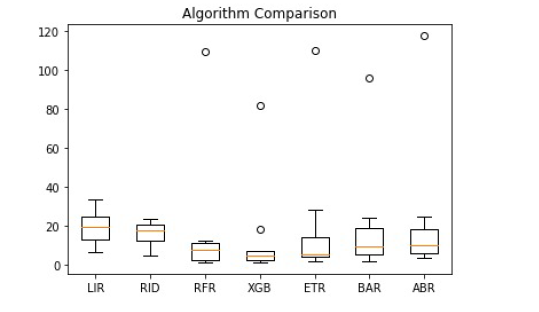

# IPL-Player-Run-Prediction

## Problem Statement
Runs at top of the order, runs at the death, runs throughout the middle overs. Runs matter everywhere and they are so important in the construction of a T20 inning. Unlike the rest of the formats where you have 3-4 specialist batsmen to accumulate the bulk of runs, T20 cricket demands different specialist batsmen at each and every phase of the innings. With the advent of franchise cricket and mainly IPL, teams have packed themselves with suitable batting options to meet these demands. And hence the leading run-scorer of a team always need not be an opener or a number three batsman. A batsman who bats lower down the order can also end up as the leading scorer within a team, much like Rishabh Pant or Andre Russell in the previous seasons.

### Objective
The objective of the problem statement is to predict Total runs of a player in IPL 2020. The output file should contain only Player Name and the respective IPL 2020 for the test data.

### Data Description
There are 2 files provided:
1. **Variable_Description.xlsx:**
This file contains description of all the variables available in the dataset
2. **Data.xlsx:**
This contains train dataset on which model has to be trained, which contains parameters of IPL 2018 and total runs in the IPL 2019. It also contains test dataset, which contains parameters of IPL 2019, using which you need to predict total runs in IPL 2020.

## Procedure
1. Importing the libraries and the data.

2. Analyzing the Data I found that the variable Highest Score (HS) and Average (Avg) were stored as string. So I converted them to float.

3. Created some New Features using the existing Features. Such as: 
**Runs from Boundary** = 4\***4s** + 6\***6s** 
**Runs without Boundary** = **Total Runs** - **Runs from Boundary** 
**StrikeRate without Boundary** = **Runs without Boundary** / ( **Number of Balls Played** - **4s** - **6s** ) 

4. Now I plotted all the features using plots such as **Area plot, KDE plot, Heatmap**  to get more information about the features.

5. Now I scaled the features using **sklearn's Standard Scalar** to feed as input to the models.

6. Now tested multiple models using sklearn's K-Folds techinque.
 

7. Now using these models, I created two new models: **Stacking** and **Voting**.

8. Used these models to predict the runs of 2020 IPL Player's using the 2019 Data.
